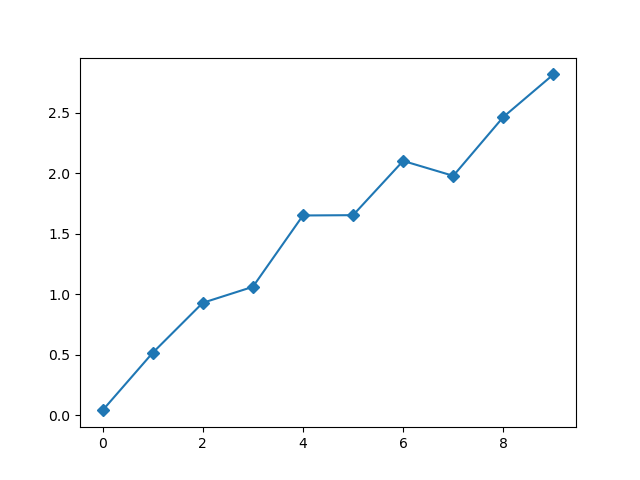
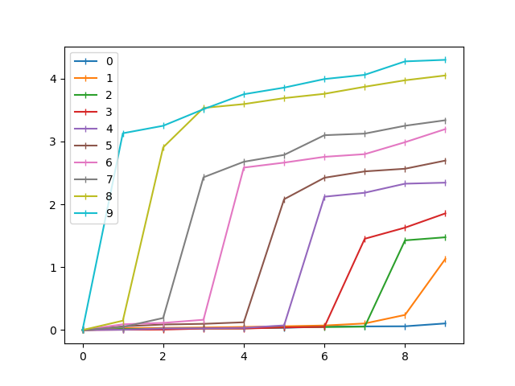
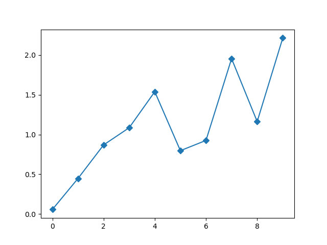
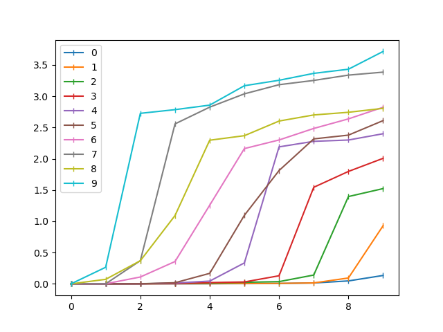

# MNISTのラベルを歪める実験

MNISTについて，第1段階ではラベルを入れ替えない，第2段階では0と1のラベルをランダムに入れ替える，第3段階では0〜2のラベルをランダムに入れ替える，…，最後は全ラベルをランダムに入れ替えることにより，どんどん学習がしにくい状態を作っていく．それがラプラシアン行列の固有値やCSGにどう現れるかを見る．

## Umapの場合

最後の方で単調増加しなくなる

### 固有値

### CSG

## t-SNEの場合

論文ほどきれいにはならない

### 固有値

### CSG

